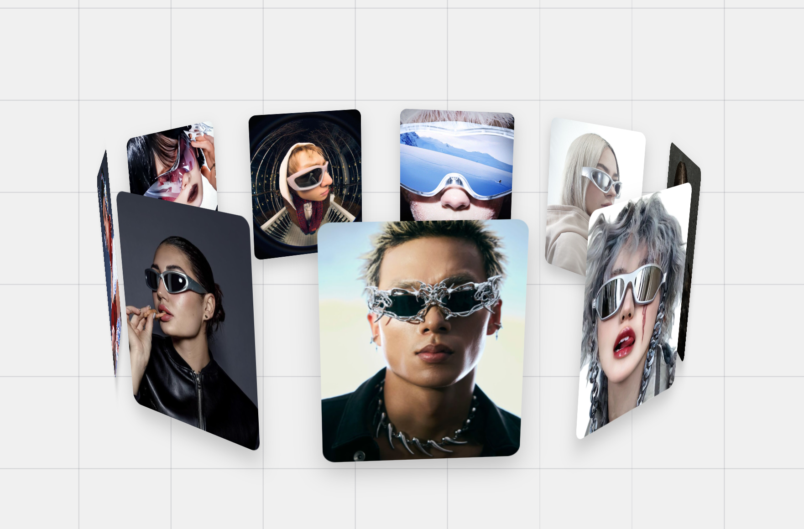

# 3D Interactive Image Carousel

A stunning 3D image carousel with interactive drag controls and particle effects, featuring a glassmorphic UI design.

## Preview

### Video Demo
Video preview available locally (preview_vid.mov) - Shows the interactive drag controls and animations in action

## Features

- **3D Rotating Carousel**: Nine images arranged in a circular, 3D formation with smooth auto-rotation
- **Interactive Controls**:
  - Drag on empty space to control viewing angle (X and Y axis rotation)
  - Images maintain their carousel positions while you adjust the viewing perspective
- **Particle Effects**: Click on any image to trigger unique GSAP-powered particle animations
- **Glassmorphic Design**: Beautiful frosted glass modal with organic blob shape animation
- **Responsive Layout**: Adapts to different screen sizes with optimized layouts

## Technologies Used

- HTML5
- CSS3 (with advanced animations and transforms)
- JavaScript (ES6)
- GSAP (GreenSock Animation Platform) for particle effects

## Installation

1. Clone the repository
2. Ensure all image files are in the `Images/` directory (1.jpeg through 9.jpeg)
3. Open `index.html` in a modern web browser

## Usage

- **Drag Control**: Click and drag on the empty background to rotate the carousel view
- **Image Interaction**: Click on individual images to trigger particle effects
- **Auto-rotation**: The carousel automatically rotates when not being interacted with

## Credits

This project is inspired by and adapted from [HoanghoDev's YouTube V2 Project](https://github.com/HoanghoDev/youtube_v2/tree/main).

Original concept and base implementation by HoanghoDev.

## Author

**Hana Oh**
Web Design Practice - Interactive 3D Gallery

## License

This project is for educational and practice purposes.